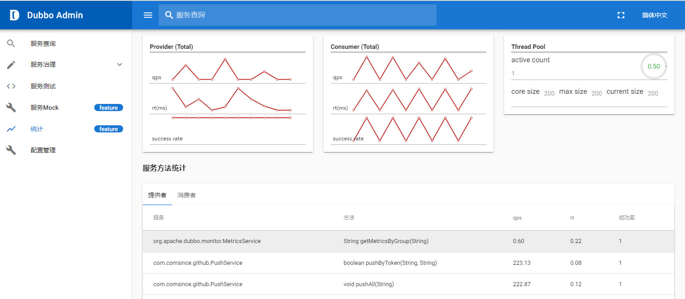
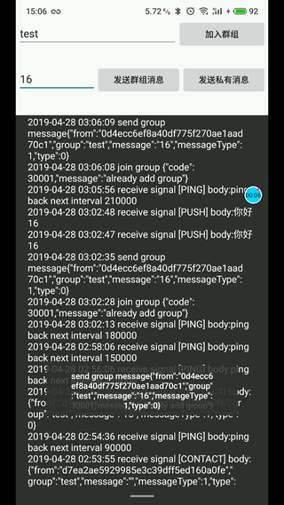

# 概述
这个一个基础的消息通信架构，只在解决服务端与客户端消息通信，可应用于消息推送，即时通信以及由此衍生出来的消息通信业务。本项目基于其他开源项目的基础上，
希望通过合理的分布式架构，解决大规模并发链接的问题，从而适应互联网用户不断增长的需求，本项目将会采用微服务的开发与设计模式进行架构设计，尽量保持各个业务的单一性和高可用性。
这样的目的也是基于业务扩展的方式，方便以后能够在基于此通信架构基础上衍生其他相关业务，从而保持业务的独立性，增加项目的可维护性。

> 为了开源以及方便部署,将更换RPC框架为`Dubbo`,并且全部基于`SpringBoot`

* [本项目github地址](https://github.com/comsince/universe_push)

# 部署说明


## 准备工作
为了脚本能够正常工作,请先在你的服务器建立如下目录`/opt/boot`,这个是脚本自动查找spring boot工程的目录,该目录下存放所有spring boot工程,具体工程目录结构如下：

## 依赖组件
* __redis__  
  `push-connector`集群模式下需要进行消息推送，利用redis的`sub/pub`进行消息的订阅与发布进而进行全局推送
* __zookeeper__  
  dubbo使用了zookeeper作为注册中心，因此需要安装zookeeper
  
## 启动停止服务

> 例如push-sub的启动方式，其他类同

```shell
# 启动服务
./push-sub start
# 停止服务
./push-sub stop
```

## SpringBoot Dubbo服务启动
由于dubbo严格遵守服务依赖启动顺序，请安装顺序启动如下服务,本次版本加入了dubbo的metric功能，对dubbo的代码进行适当的改造，使用的这里的代码编译出来[dubbo-2.7.2-SNAPSHOT](https://github.com/comsince/incubator-dubbo),此功能大家可以等到dubbo-2.7.2正式发布

### Dubbo admin metric
本项目引入dubbo admin监控项目，由于dubbo-2.7.2正式版没有发布所以对dubbo的相关项目做了改造以适应dubbo-metric数据统计，如果你在编译过程中遇到错误，可以到这里下载项目本地编译即可


* [dubbo](https://github.com/comsince/incubator-dubbo)
* [dubbo-springboot-starter](https://github.com/comsince/incubator-dubbo-spring-boot-project)
* [dubbo-admin]()

* `application.properties`配置`redis`和`zookeeper`地址

> 这里没用使用诸如`nacos`,`apollo`外部的配置中心，需要自己手动修改

```properties
push.redis.address=redis://172.16.46.213:6379
```

> 增加push-connector kafka集羣支持

```properties
## kafka broker
push.kafka.broker=172.16.177.107:9092
```

* 运行`mvn clean package -Dmaven.test.skip=true` 打包springboot jar 

> 以下服务如果用户量增加，都可以集群部署

* 启动`spring-boot-dubbo-push-subscribe`订阅服务
```shell
/opt/boot/push-sub
├── jvm.ini
├── push-sub //可执行启动脚本
└── log
   └── push-sub.log //存放日志
└── lib
   └── spring-boot-dubbo-push-subscribe-1.0.0-SNAPSHOT.jar //可运行的jar
```

* 启动`spring-boot-dubbo-push-connector`链接服务

```shell
/opt/boot/push-connector
├── jvm.ini
├── push-connector //可执行启动脚本
└── log
   └── push-connector.log //存放日志
└── lib
   └── spring-boot-dubbo-push-connector-1.0-SNAPSHOT.jar //可运行的jar
```

## SpringBoot web项目

* 启动`spring-boot-web-push-api`开放推送服务
```shell
/opt/boot/push-api
├── jvm.ini
├── push-api //可执行启动脚本
└── log
   └── push-api.log //存放日志
└── lib
   └── spring-boot-web-push-api-1.0.0-SNAPSHOT.jar //可运行的jar
```


* 启动`sping-boot-web-push-group`群组服务
```shell
/opt/boot/push-group
├── jvm.ini
├── push-group //可执行启动脚本
└── log
   └── push-group.log //存放日志
└── lib
   └── sping-boot-web-push-group-1.0.0-SNAPSHOT.jar //可运行的jar
```

## 推送SDK
为了方便用户快速接入消息推送系统，特提供如下SDK

* __[AIO-PUSHSDK](push-sdk/push-aio-sdk)__
* __[NIO-PUSHSDK](push-sdk/push-nio-sdk)__
* 基于NIO-PUHSDK的[AndroidPushDemo](demo/AndroidPushDemo),这个demo主要演示重定向，心跳，消息推送，群组消息的基本功能



# 基础架构
## Push-connector
### 基本功能
* 提供集群链接管理的能力
* 提供消息群发的功能
* 提供消息单发的功能
* 客户端管理服务


## Push-Router
### 基本功能
* 只有在全网推送的模式下采用基于redis的发布订阅模型
* 推送时能够根据token选择指定的push-connector直接推送
* push-router与push-connector基于私有协议通信快速发送


## Push-Sub
* 对于订阅请求，消息体如果带有token则使用当前token，不再重新生成，也即是只要客户端不清除token，下次重建链接还是可以沿用先前的token
* 对请求过来的token按照push-connector ip分组进行分组
* 订阅服务需要生成链接的唯一id,目前采用的snakeflow算法，可能由于时钟回拨的问题，可能出现重复，可以考虑[美团的leaf-snakeflow方案](https://tech.meituan.com/2017/04/21/mt-leaf.html)

## Push-Cache[计划中]
### 基本功能
提供消息缓存服务
* 消息缓存
* 消息过期

## Push-API
### 基本功能
提供推送Http接口服务，调用推送网关发送推送消息，此接口采用springboot开发web服务


## Push-Group
* 单聊服务
* 群组服务

## Push-statics
* 统计服务，负责对任务推送进行数据统计，方便以后进行到达率等重要指标分析,包括推送数，到达数，点击数，删除数(这些主要时针对通知栏推送)

# 部署
## 常见问题

> 部署connector要同时更新，防止出现redisson发布订阅数据解析问题

> redisson 发布时最好使用统一个logger,不然会有序列化问题

# 参考资料
## 参考项目
* [T-io](https://github.com/tywo45/t-io)
* [蚂蚁通信框架实践](https://mp.weixin.qq.com/s/JRsbK1Un2av9GKmJ8DK7IQ)

